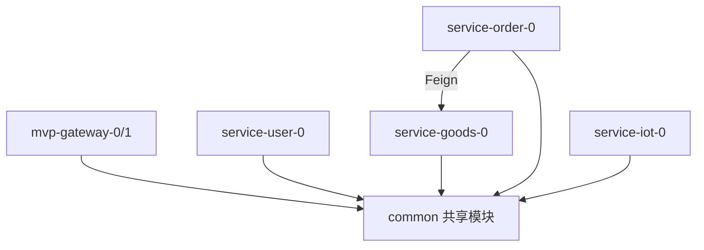
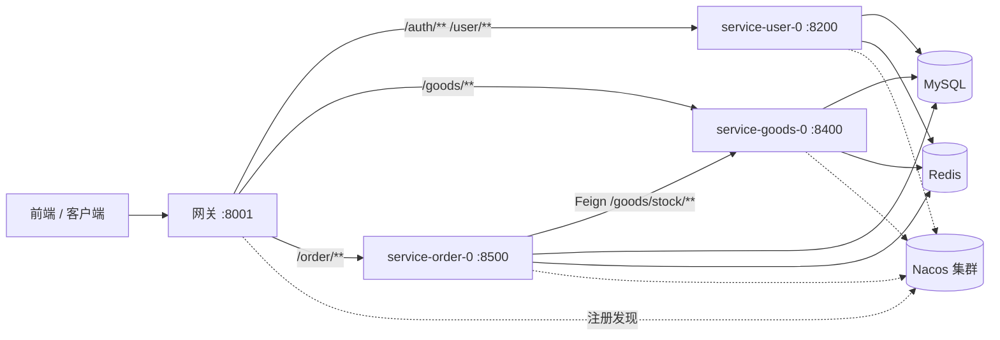

# 整体架构设计

## 1. 文档说明

本文档描述 SpringCloudAlibabaMVP 项目的整体架构、模块划分、技术栈、请求链路和服务协作,作为各专项文档(`order-flow-design.md`、`goods-service-design.md`)的总览。

## 2. 技术栈

| 层面 | 选型 |
| --- | --- |
| 基础框架 | Spring Boot 3.3.4 / JDK 17 |
| 微服务 | Spring Cloud 2023.0.3 + Spring Cloud Alibaba 2023.0.3.2 |
| 注册/配置中心 | Nacos(三节点集群) |
| 网关 | Spring Cloud Gateway(WebFlux 响应式) |
| 服务间调用 | OpenFeign + LoadBalancer |
| 数据访问 | MyBatis-Plus 3.5.12 + dynamic-datasource(主从) |
| 缓存 | Redis + Redisson 3.37.0 |
| 鉴权 | JWT(accessToken + refreshToken) |
| 其他 | Fastjson2、自研 UUIDv7 主键 |

## 3. 模块划分

```
SpringCloudAlibabaMVP (pom)
├── common               跨模块共享:BaseController、ResultVO、ResultCode、
│                        JWT 工具、UUIDv7、MyBatis-Plus 分页自动配置、SQL
├── mvp-gateway-0        网关(鉴权 + 路由 + 透传 X-User-Id)，可启动多实例
└── services
    ├── service-user-0   用户与鉴权(注册/登录/刷新/登出)
    ├── service-iot-0    IoT 设备数据(MQTT 温湿度上报)
    ├── service-goods-0  秒杀商品配置 + 库存权威
    └── service-order-0  秒杀下单 + 订单 + RocketMQ 异步处理
```

模块依赖关系:



> common 的 MyBatis-Plus starter 依赖标记为 optional,不向网关传递,避免网关(WebFlux,无数据源)被动触发数据源自动配置而启动失败;业务服务各自显式声明该 starter。

## 4. 请求链路



## 5. 网关路由与鉴权

### 5.1 路由表(application-route.yml)

| 路径 | 目标服务 |
| --- | --- |
| `/auth/**` | `lb://service-user-0` |
| `/user/**` | `lb://service-user-0` |
| `/goods/**` | `lb://service-goods-0` |
| `/order/**` | `lb://service-order-0` |

均使用 `lb://` 通过 Nacos + LoadBalancer 选择实例。

### 5.2 鉴权流程

`AuthGlobalFilter`(order 较高,优先执行):

1. 命中白名单(`/auth/register/code`、`/auth/register`、`/auth/login`、`/auth/refresh`)直接放行。
2. 取 `Authorization: Bearer <token>`,解析校验 accessToken。
3. 查 Redis 黑名单(`auth:blacklist:{jti}`),已登出则拒绝。
4. 通过后注入 `X-User-Id`、`X-Token-Jti` 请求头透传给下游。

下游服务无需自己解析 token,直接从 `X-User-Id` 取用户身份。Feign 内部调用不过网关,因此不带这些头。

## 6. 端口分配

| 服务 | 端口 |
| --- | --- |
| 网关 mvp-gateway-0/1 | 8001 |
| service-user-0 | 8200 |
| service-iot-0 | 8300 |
| service-goods-0 | 8400 |
| service-order-0 | 8500 |

## 7. 共享约定

- **统一返回**:`ResultVO<T>`(code/message/data/timestamp),状态码见 `ResultCode`。
- **通用 CRUD**:`BaseController<E, D>` 提供按 id 查/分页/增/改/删,子类只传实体和 DTO 泛型,对外收发 DTO、内部操作实体。
- **主键**:`IdType.ASSIGN_UUID` + `UuidV7IdentifierGenerator`,生成 32 位无横杠 UUIDv7。
- **分页**:common 自动装配 MyBatis-Plus 分页拦截器,`BaseController.page()` 走物理分页。
- **数据源**:dynamic-datasource 配 master/slave,默认 master。

## 8. 秒杀链路概览

秒杀按领域拆为 goods(商品+库存)和 order(下单+订单)两个服务,通过 Feign 协作:

- 库存权威集中在 goods 的 Redis 原子计数。
- 防超卖:Redis 原子扣减 + 订单唯一索引。
- 防重:Redis 用户标记 + 数据库订单查询 + 唯一索引,三层。
- 同步落单,落库失败由 order 回补 goods 库存维持最终一致。

详见 `order-flow-design.md` 和 `goods-service-design.md`。

## 9. 当前整体限制

- 已接入 RocketMQ 异步下单主链路,同步落单仅作为降级兜底。
- 没有全局异常处理,失败响应格式不完全统一。
- 没有接口限流、防刷、热点隔离。
- 内部接口经网关可达,缺内网隔离。
- 没有链路追踪与指标采集。
