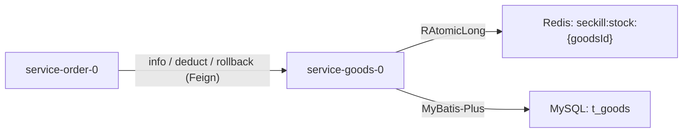

# 商品服务设计

## 1. 文档说明

本文档描述 `service-goods-0` 的职责、数据表、接口、库存设计和与订单服务的协作方式,基于当前项目代码编写。

代码位置:

- 服务模块:`services/service-goods-0`,包 `com.mvp.goods`
- 应用名:`service-goods-0`,端口 `8400`
- 数据表:`common/src/main/resources/sql/mvp.sql` 的 `t_goods`

版本定位:

- 商品服务从秒杀链路中拆出,专注两件事:商品配置维护(CRUD)、库存权威管理(Redis 原子计数)。
- 它是库存的唯一权威方,订单服务只通过 Feign 调用本服务完成库存预扣和回补,不直接操作库存 key。

## 2. 模块结构

```
com.mvp.goods
├── GoodsApplication              启动类(@MapperScan + scan com.mvp.common)
├── entity/Goods                  t_goods 实体
├── dto/GoodsDto                  CRUD 入参/出参 DTO(带校验)
├── dto/GoodsInfoDto              商品快照(对 order 输出,Feign 契约)
├── mapper/GoodsMapper            BaseMapper<Goods>
├── service/GoodsService          IService<Goods> + 库存能力
├── service/impl/GoodsServiceImpl 商品 CRUD + Redis 库存预扣/回补
├── controller/GoodsController    /goods 管理端 CRUD(继承 BaseController)
└── controller/GoodsStockController /goods/stock 内部接口(供 Feign)
```

共享能力来自 `common` 模块:`BaseController`、`ResultVO`、`ResultCode`、`UuidV7IdentifierGenerator`、MyBatis-Plus 分页自动配置。

## 3. 数据表 t_goods

| 字段 | 类型 | 说明 |
| --- | --- | --- |
| `id` | CHAR(32) | 商品 ID,32 位无横杠 UUIDv7 |
| `name` | VARCHAR(200) | 商品名称 |
| `seckill_price` | DECIMAL(10,2) | 秒杀价 |
| `total_stock` | INT | 总库存(仅作 Redis 初始化种子和展示) |
| `limit_per_user` | INT | 每人限购数量 |
| `start_time` | DATETIME | 秒杀开始时间 |
| `end_time` | DATETIME | 秒杀结束时间 |
| `status` | TINYINT | 0-禁用,1-启用 |
| `created_at` / `updated_at` | DATETIME | 时间戳 |

索引:`idx_goods_status` 按状态查询。

设计要点:

- 精简版**没有 `available_stock` 列**,真实剩余库存完全由 Redis 计数维护,`total_stock` 只是初始化种子和展示用途。
- 商品表自带时间窗口,不再有独立活动维度,库存 key 只按商品 ID 区分。

## 4. 接口设计

### 4.1 管理端 CRUD(`/goods`,继承 BaseController)

| 方法 | 路径 | 说明 |
| --- | --- | --- |
| `GET` | `/goods/{id}` | 查询商品详情 |
| `GET` | `/goods/page?page=&size=` | 分页查询 |
| `POST` | `/goods` | 新增商品配置 |
| `PUT` | `/goods/{id}` | 修改商品配置 |
| `DELETE` | `/goods/{id}` | 删除商品配置 |

入参 `GoodsDto` 校验:名称非空且 ≤200、秒杀价 ≥0、总库存 ≥0、限购 ≥1、起止时间非空、状态 0/1。

### 4.2 内部接口(`/goods/stock`,供 order 服务 Feign)

| 方法 | 路径 | 说明 | 返回 |
| --- | --- | --- | --- |
| `GET` | `/goods/stock/{id}/info` | 商品快照 | `ResultVO<GoodsInfoDto>` |
| `POST` | `/goods/stock/{id}/deduct?count=` | 预扣库存 | `ResultVO<Boolean>` |
| `POST` | `/goods/stock/{id}/rollback?count=` | 回补库存 | `ResultVO<Void>` |

`GoodsInfoDto` 字段:`id`、`goodsName`、`seckillPrice`、`totalStock`、`limitPerUser`、`startTime`、`endTime`、`status`。商品服务只做存在性判断,启用/时间窗/限购等业务校验交给 order 服务。

## 5. 库存设计

库存 key:`seckill:stock:{goodsId}`,用 Redisson `RAtomicLong` 维护。

### 5.1 预扣 deductStock(id, count)

1. `count <= 0` 或商品不存在 → 返回 false。
2. key 不存在 → `compareAndSet(0, total_stock)` 懒加载,设 1 天过期。
3. `addAndGet(-count)` 原子扣减。
4. 结果 < 0 → `addAndGet(+count)` 回补,返回 false(售罄);否则返回 true。

### 5.2 回补 rollbackStock(id, count)

`addAndGet(+count)`,把预扣成功但未落单的数量加回。

### 5.3 关键性质

- **原子性**:`addAndGet` 保证并发下不会两个请求读到同一剩余值,是防超卖核心。
- **懒加载竞争**:首次访问用 `compareAndSet` 初始化,高并发冷启动存在初始化竞争,生产版建议活动开始前预热。
- **权威集中**:库存只在本服务读写,order 通过 Feign 参与,避免库存账目分散到多服务难以对账。

## 6. 与订单服务协作



- order 下单前调 `info` 校验商品,调 `deduct` 预扣;落库失败调 `rollback` 回补。
- 详见 `order-flow-design.md`。

## 7. 当前限制

- 库存懒加载存在冷启动初始化竞争,缺预热接口。
- 内部接口 `/goods/stock/**` 经网关也可达,生产环境建议内网隔离或独立鉴权。
- 商品删除是物理删除(BaseController `removeById`),未配置逻辑删除。
- 没有库存对账/定时校准任务。
