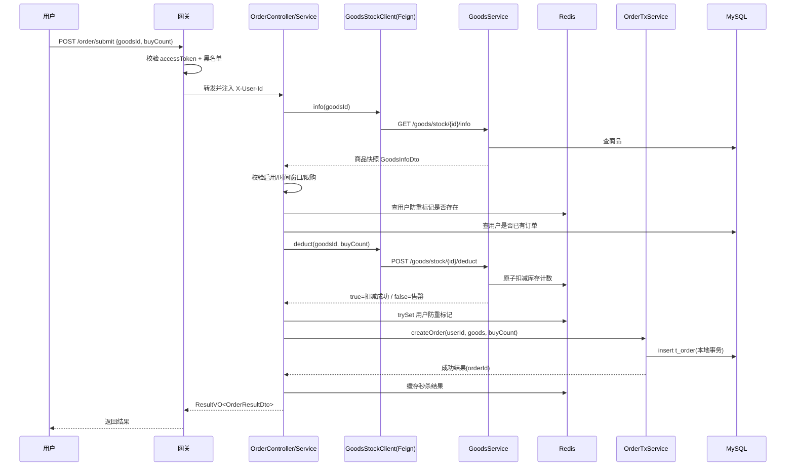
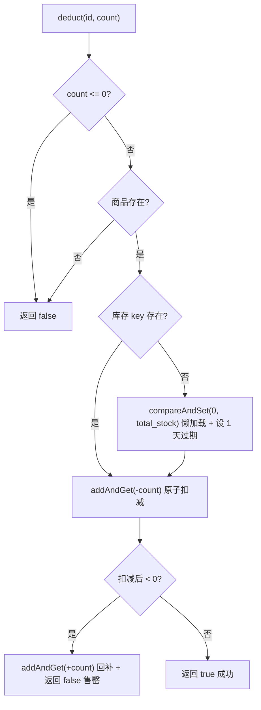
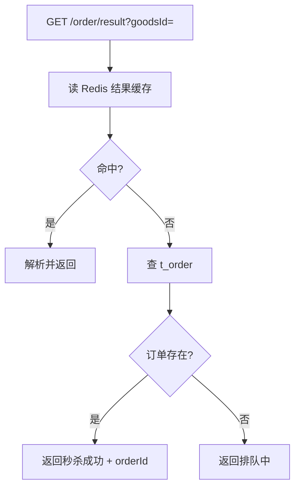

# 秒杀下单详细流程

## 1. 文档说明

本文档基于当前项目代码,详细描述一次秒杀下单从用户发起到结果返回的完整链路,覆盖参与组件、时序、每一步的代码细节、库存预扣、防重、事务边界和失败补偿。

涉及的核心代码位置:

- 下单入口:`services/service-order-0`,包 `com.mvp.order`
  - `OrderController#submit` / `OrderController#result`
  - `OrderServiceImpl#doSeckill` / `OrderServiceImpl#queryResult`
  - `OrderTxServiceImpl#createOrder`(独立事务 Bean)
  - `GoodsStockClient`(Feign 客户端)
- 库存权威:`services/service-goods-0`,包 `com.mvp.goods`
  - `GoodsStockController`(内部接口 `/goods/stock`)
  - `GoodsServiceImpl#deductStock` / `#rollbackStock` / `#getGoodsInfo`
- 数据表:`common/src/main/resources/sql/mvp.sql` 的 `t_goods`、`t_order`

当前版本定位:

- 下单服务(order)与商品/库存服务(goods)已拆分为两个独立微服务。
- order 通过 OpenFeign 调用 goods 完成商品校验和库存预扣/回补,自己不直接操作库存 key。
- 库存权威完全在 goods 服务的 Redis 原子计数,数据库 `total_stock` 仅作初始化种子。
- 防超卖:Redis 原子扣减 + 订单唯一索引。
- 防重:Redis 用户标记 + 数据库订单查询 + 订单唯一索引,三层。
- 同步落单,暂未接入 RocketMQ。

## 2. 参与组件

| 组件 | 应用名 | 端口 | 职责 |
| --- | --- | --- | --- |
| 网关 | mvp-gateway-0 / 1 | 8001 | 鉴权、透传 `X-User-Id`、按路径路由 |
| 订单服务 | service-order-0 | 8500 | 下单主流程编排、订单落库、防重、结果缓存与查询 |
| 商品服务 | service-goods-0 | 8400 | 商品配置、库存权威(Redis 预扣/回补)、商品快照 |
| MySQL | - | 3306/3307 | `t_goods` 商品配置、`t_order` 正式订单 |
| Redis | - | 6379 | 库存计数、用户防重标记、结果缓存 |
| Nacos | - | 8848-8850 | 注册发现、Feign 负载均衡、配置 |

服务边界要点:

- order **不直接读写库存 key**,所有库存变更都通过 Feign 调 goods,保证库存账目集中在一个服务里。
- goods 是库存唯一权威方;order 持有用户防重标记和结果缓存。

## 3. 接口与路由

### 3.1 对外接口(经网关)

| 方法 | 路径 | 说明 | 是否需登录 |
| --- | --- | --- | --- |
| `POST` | `/order/submit` | 发起秒杀下单 | 是 |
| `GET` | `/order/result?goodsId=` | 查询秒杀结果 | 是 |

网关路由规则(`application-route.yml`):

- `/order/**` → `lb://service-order-0`
- `/goods/**` → `lb://service-goods-0`

`/order/**` 不在网关白名单内,因此必须携带有效 accessToken;网关鉴权通过后注入 `X-User-Id` 请求头透传给下游。

### 3.2 内部接口(Feign,不过网关)

order 通过 `GoodsStockClient`(`@FeignClient(name = "service-goods-0", path = "/goods/stock")`)调用:

| 方法 | 路径 | 说明 |
| --- | --- | --- |
| `GET` | `/goods/stock/{id}/info` | 查询商品快照,供下单前校验 |
| `POST` | `/goods/stock/{id}/deduct?count=` | Redis 原子预扣库存 |
| `POST` | `/goods/stock/{id}/rollback?count=` | 回补库存 |

Feign 调用经 Nacos 服务发现直连 goods 实例,不经过网关,因此不需要 JWT 和 `X-User-Id`。

### 3.3 请求 / 响应

下单请求体 `OrderRequestDto`:

```json
{
  "goodsId": "0190000000000000000000000000abcd",
  "buyCount": 1
}
```

- `goodsId`:32 位无横杠 UUIDv7,必填。
- `buyCount`:购买数量,默认 1,范围 [1, 100],实际上限再受商品 `limitPerUser` 约束。

统一响应 `ResultVO<OrderResultDto>`:

```json
{
  "code": 200,
  "message": "操作成功",
  "data": {
    "status": 1,
    "requestNo": null,
    "orderId": "0190000000000000000000000000ef01",
    "message": "秒杀成功"
  },
  "timestamp": 1781090000000
}
```

`data.status`:0-排队中,1-成功,2-失败。

## 4. 下单主流程时序



## 5. 下单主流程详解(OrderServiceImpl#doSeckill)

下面按代码执行顺序逐步说明,步骤编号与 `doSeckill` 中的注释一致。

### 第 0 步:参数准备

从 `OrderRequestDto` 取出 `goodsId`,`buyCount` 为空时兜底为 1。

### 第 1 步:查商品快照并校验(loadAndValidateGoods)

通过 Feign `goodsStockClient.info(goodsId)` 拿到 `GoodsInfoDto`,依次校验:

1. 商品存在(响应 data 非空),否则抛 `IllegalArgumentException("商品不存在")`。
2. 状态为启用(`status == 1`),否则抛 `商品未启用`。
3. 当前时间在 `[startTime, endTime]` 区间内,否则抛 `秒杀尚未开始` / `秒杀已结束`。
4. `buyCount <= limitPerUser`,否则抛 `超过限购数量`。

校验放在最前,确保活动/商品维度的错误不会消耗后续 Redis 库存。

### 第 2 步:Redis 用户标记快速防重

读 `seckill:user:{userId}:{goodsId}` 是否存在。存在说明该用户已抢过或正在处理,直接返回 `失败-请勿重复秒杀`。这是入口处的快速失败,挡住短时间重复点击。

### 第 3 步:数据库订单兜底防重

`count(t_order where user_id=? and goods_id=?) > 0` 则返回 `失败-您已秒杀成功，请勿重复下单`。这一层覆盖 Redis 标记失效、服务重启等缓存不可靠的场景。

### 第 4 步:Feign 预扣库存

调用 `goodsStockClient.deduct(goodsId, buyCount)`,返回 false(售罄或调用失败)则返回 `失败-商品已售罄`。

> 顺序说明:这里先扣库存、再抢用户标记(第 5 步)。极端并发下同一用户的两个请求可能都通过了第 2/3 步防重,于是都来扣一次库存,随后只有一个能抢到用户标记,另一个会在第 5 步回补。这是一个已知的小竞态窗口,最终不会超卖(Redis 原子扣减 + 订单唯一索引兜底),但会短暂多占一个名额。

### 第 5 步:抢用户防重标记

`trySet("1", ttl)` 仅首次成功。失败说明并发下已有请求占位,**必须回补第 4 步刚预扣的库存**(`rollbackStock`),否则失败请求会平白吃掉一个名额,然后返回 `失败-请勿重复秒杀`。

TTL 由 `resultTtl(goods)` 计算:至少 2 小时,若商品结束时间更晚则延长到结束时间,避免活动期间标记提前失效。

### 第 6 步:落正式订单(独立事务 Bean)

调用 `orderTxService.createOrder(...)`。通过外部 Bean 调用触发 Spring 事务代理,避免同类自调用导致 `@Transactional` 失效。成功后:

1. `cacheResult` 把成功结果写入 `seckill:result:{userId}:{goodsId}`。
2. 记录成功日志,返回结果。

### 第 7 步:落库失败补偿(compensateOnFailure)

捕获异常后执行补偿,再把异常抛出:

1. 删除用户防重标记。
2. Feign 回补库存。
3. 缓存失败结果。
4. 记录 warn 日志。

由于 Feign 预扣和数据库事务不在同一边界内,落库失败必须手动回滚远程库存和本地缓存状态。

## 6. 库存预扣与回补(GoodsServiceImpl)

库存权威在 goods 服务的 Redis 原子计数,key 为 `seckill:stock:{goodsId}`。

### 6.1 预扣 deductStock



要点:

- **懒加载初始化**:key 不存在时用数据库 `total_stock` 作为种子,`compareAndSet(0, seed)` 保证只有第一个请求能写入,其余并发请求不会覆盖已有计数。高并发冷启动存在初始化竞争,生产版建议活动开始前预热。
- **原子扣减**:`addAndGet(-count)` 是原子操作,并发下不会出现两个请求读到同一剩余值,这是防超卖第一道防线。
- **扣过头回补**:扣减后小于 0 说明已售罄,立即 `addAndGet(+count)` 把刚扣的补回去,确保计数不会因失败请求持续往负数累积。

### 6.2 回补 rollbackStock

`addAndGet(+count)`,把预扣成功但最终没落单的数量加回。不判断 key 是否存在,因为能触发回补说明之前一定预扣过。

## 7. 事务边界

| 操作 | 是否在数据库事务内 | 说明 |
| --- | --- | --- |
| 插入 `t_order` | 是 | `OrderTxServiceImpl#createOrder` 上的 `@Transactional(rollbackFor = Exception.class)` |
| Redis 库存预扣/回补 | 否 | 在 goods 服务,跨服务、跨存储 |
| Redis 用户标记/结果缓存 | 否 | 在 order 服务内存操作 Redis |
| Feign 远程调用 | 否 | 网络调用 |

`createOrder` 事务内只做一件事:

1. 组装订单,`amount = seckillPrice × buyCount`,状态待支付。
2. `save(order)`,依赖唯一索引 `uk_order_user_goods (user_id, goods_id)` 兜底防重。
3. 唯一索引冲突抛 `DuplicateKeyException` → 转成业务异常 `您已秒杀成功，请勿重复下单` → 触发事务回滚 + 外层第 7 步库存回补。

由于库存(Redis,goods 服务)和订单(MySQL,order 服务)是两个独立存储,没有分布式事务,靠"预扣成功 + 落库失败补偿回补"维持最终一致。

## 8. 防超卖与防重总结

防超卖(两道):

1. Redis `addAndGet` 原子扣减,扣到负数立即回补。
2. 订单唯一索引,极端情况下也不会出现同一用户重复成功。

> 注意:精简版数据库 `t_goods` 没有 `available_stock` 列,数据库层不再有"库存条件更新"兜底,库存权威完全落在 Redis。

防重(三层):

1. Redis 用户标记 `seckill:user:{userId}:{goodsId}`,挡短时间重复请求。
2. 下单前查 `t_order`,覆盖缓存失效。
3. 唯一索引 `uk_order_user_goods`,最终兜底。

## 9. Redis Key 设计

| Key | 持有方 | 用途 | 过期 |
| --- | --- | --- | --- |
| `seckill:stock:{goodsId}` | goods | 库存原子计数 | 1 天 |
| `seckill:user:{userId}:{goodsId}` | order | 用户防重标记 | ≥2 小时,至少到活动结束 |
| `seckill:result:{userId}:{goodsId}` | order | 结果缓存 | 2 小时 |

结果缓存值为竖线分隔字符串 `status|requestNo|orderId|message`(`encodeResult` / `decodeResult`),最小实现下省掉 JSON 序列化器配置;`split("\\|", -1)` 保留尾部空段避免解析错位。

## 10. 结果查询流程(OrderServiceImpl#queryResult)



查询优先级:Redis 结果缓存 → 数据库订单表 → 排队中。精简版没有请求日志表,因此没有"失败原因回查"层;同步落单下 `submit` 已直接返回成败,`result` 主要服务前端轮询和为后续 MQ 异步落单预留。

## 11. 失败返回一览

| 触发点 | 返回形态 | message |
| --- | --- | --- |
| 用户标记已存在(第 2 步) | `ResultVO.ok`,data.status=2 | 请勿重复秒杀 |
| 已有订单(第 3 步) | `ResultVO.ok`,data.status=2 | 您已秒杀成功，请勿重复下单 |
| 库存预扣失败(第 4 步) | `ResultVO.ok`,data.status=2 | 商品已售罄 |
| 抢标记失败(第 5 步) | `ResultVO.ok`,data.status=2 | 请勿重复秒杀 |
| 商品不存在/未启用/未开始/已结束/超限购 | 抛 `IllegalArgumentException` | 对应文案 |
| 唯一索引冲突(事务内) | 抛 `IllegalArgumentException` | 您已秒杀成功，请勿重复下单 |

> 注意:部分校验通过 `failResult` 返回 `ResultVO.ok` 包裹的失败状态(data.status=2),另一部分直接抛异常。当前没有全局异常处理器,抛出的异常会以框架默认错误结构返回,与 `ResultVO` 不一致。统一失败出口可在 common 增加 `@RestControllerAdvice`,把业务异常包成 `ResultVO.fail`。

## 12. 当前限制与演进

- 同步落单,未接 RocketMQ 削峰;高并发下可改为预扣成功即返回"排队中",MQ 异步建单。
- 库存懒加载存在冷启动初始化竞争,可加活动开始前预热接口。
- 没有全局异常处理,失败响应格式不统一。
- 没有支付超时取消与库存回补流程,订单建成后停在待支付。
- 内部库存接口 `/goods/stock/**` 经网关也可达,生产环境建议内网隔离或独立鉴权。
- 没有接口限流、防刷、热点隔离。


