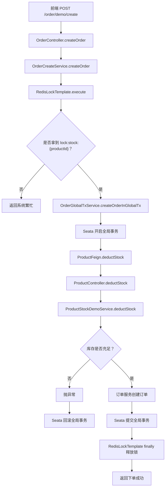

# Redis 锁 + Seata 下单 Demo 调用过程

## 一、整体流程



## 二、调用链路和对应文件

| 步骤 | 说明 | 文件 |
|---|---|---|
| 1 | 前端提交下单请求，进入订单服务 Controller | `services/service-order-0/src/main/java/com/mvp/order/controller/OrderController.java` |
| 2 | Controller 调用下单入口 Service | `services/service-order-0/src/main/java/com/mvp/order/service/OrderCreateService.java` |
| 3 | 按商品维度生成 Redis 锁 key：`lock:stock:{productId}` | `services/service-order-0/src/main/java/com/mvp/order/service/OrderCreateService.java` |
| 4 | Spring Data Redis 通过 `SET NX EX` 尝试获取分布式锁 | `services/service-order-0/src/main/java/com/mvp/order/redis/RedisLockTemplate.java` |
| 5 | 拿到锁后，调用 Seata 全局事务方法 | `services/service-order-0/src/main/java/com/mvp/order/service/OrderGlobalTxService.java` |
| 6 | `@GlobalTransactional` 开启全局事务 | `services/service-order-0/src/main/java/com/mvp/order/service/OrderGlobalTxService.java` |
| 7 | 订单服务通过 Feign 调用商品服务扣库存 | `services/service-order-0/src/main/java/com/mvp/order/feign/ProductFeign.java` |
| 8 | 商品服务接收扣库存请求 | `services/service-product-0/src/main/java/com/mvp/product/controller/ProductController.java` |
| 9 | 商品服务执行库存扣减 demo | `services/service-product-0/src/main/java/com/mvp/product/service/ProductStockDemoService.java` |
| 10 | 库存不足时抛异常，Seata 回滚全局事务 | `services/service-order-0/src/main/java/com/mvp/order/service/OrderGlobalTxService.java` |
| 11 | 成功或失败后，`finally` 使用 Lua 校验 token 并释放 Redis 锁 | `services/service-order-0/src/main/java/com/mvp/order/redis/RedisLockTemplate.java` |

## 三、为什么 Redis 锁和 Seata 都要用

Redis 锁解决的是并发入口问题：

```text
同一个商品同一时刻只让一个下单请求进入扣库存流程。
```

Seata 解决的是跨服务数据库一致性问题：

```text
订单库、商品库、用户库等多个数据库操作一起提交或一起回滚。
```

它们的边界不同：

```text
Redis 锁不会被 Seata 回滚。
Seata 也不能替代 Redis 锁拦住高并发请求。
```

所以顺序是：

```text
先拿 Redis 锁
再开启 Seata 全局事务
事务成功或失败后释放 Redis 锁
```

## 四、测试接口

创建订单：

```bash
curl -X POST http://127.0.0.1:8100/order/demo/create \
  -H "Content-Type: application/json" \
  -d '{"userId":1,"productId":1001,"count":1,"totalAmount":99.00}'
```

查看商品库存：

```bash
curl http://127.0.0.1:8200/product/demo/stock/1001
```

## 五、真实项目要替换的地方

当前 demo 的库存放在内存里：

```text
ProductStockDemoService.stockMap
```

真实商城要改成数据库条件扣库存：

```sql
UPDATE product
SET stock = stock - #{count}
WHERE id = #{productId}
  AND stock >= #{count};
```

如果影响行数是 `0`，说明库存不足，抛异常让 Seata 回滚。

真实订单创建位置在：

```text
OrderGlobalTxService.createOrderInGlobalTx
```

当前只是生成随机订单号，后面要替换成：

```text
orderMapper.insert(order)
```
