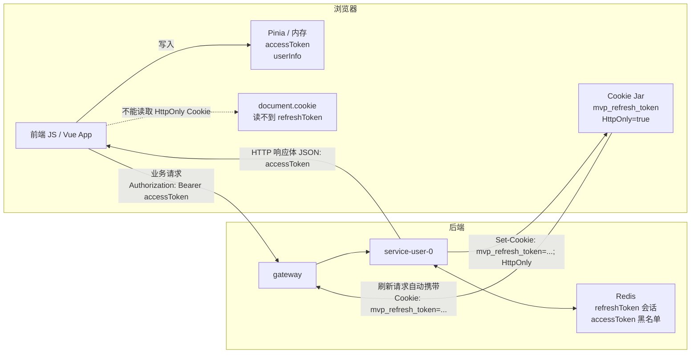
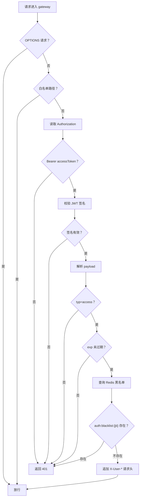

# HttpOnly Cookie + 双 Token + Redis 认证流程

本文档说明当前项目的登录认证方案：`accessToken` 只保存在前端 Pinia/内存中，`refreshToken` 写入后端 `HttpOnly Cookie`，Redis 保存服务端有效会话，gateway 统一校验业务请求的 `accessToken`。

## 一、核心结论

当前方案不是把两个 token 都交给前端保存，而是拆开职责：

| 凭证 | 存放位置 | 用途 | 前端 JS 能否读取 |
| --- | --- | --- | --- |
| `accessToken` | Pinia/内存 | 访问业务接口，放入 `Authorization` 请求头 | 能 |
| `refreshToken` | `HttpOnly Cookie` + Redis | 刷新新的 `accessToken`，维持长期登录态 | 不能 |
| `accessToken` 黑名单 | Redis | 登出后拒绝旧 `accessToken` | 不能 |

这样做的好处：

```text
1. accessToken 有效期短，即使泄露，风险窗口也较小。
2. refreshToken 有效期长，但不暴露给前端 JS，降低 XSS 读取风险。
3. Redis 保存 refreshToken，让服务端可以主动登出、轮换、禁用。
4. gateway 统一校验 accessToken，业务服务不用重复解析 JWT。
```

## 二、模块职责

| 模块 | 职责 |
| --- | --- |
| `vue3mvp/mvp_app` | 登录页、Pinia 登录状态、axios 自动刷新、路由守卫 |
| `gateway` | 白名单放行注册/登录/刷新，校验业务请求的 `accessToken` |
| `service-user-0` | 校验账号密码、签发 token、写 Cookie、刷新、登出 |
| Redis | 保存 `refreshToken`，保存已登出的 `accessToken` 黑名单 |
| 业务服务 | 接收 gateway 透传的用户上下文并处理业务 |

关键代码位置：

```text
前端 API：vue3mvp/mvp_app/src/api/auth.ts
前端状态：vue3mvp/mvp_app/src/stores/authStore.ts
前端用户 Store：vue3mvp/mvp_app/src/stores/userStore.ts
前端请求拦截：vue3mvp/mvp_app/src/utils/http/axios.ts
后端认证入口：services/service-user-0/src/main/java/com/mvp/user/controller/AuthController.java
后端认证实现：services/service-user-0/src/main/java/com/mvp/user/service/impl/AuthServiceImpl.java
网关过滤器：gateway/src/main/java/com/mvp/gateway/auth/filter/AuthGlobalFilter.java
JWT 签发/验签工具：common/src/main/java/com/mvp/common/jwt/JwtUtil.java
```

## 三、整体链路

```mermaid
sequenceDiagram
    participant F as 前端
    participant G as gateway
    participant U as service-user-0
    participant R as Redis
    participant B as 业务服务

    F->>G: POST /auth/login
    G->>U: 白名单放行
    U->>U: 校验账号、密码、账号状态
    U->>U: 生成 accessToken + refreshToken
    U->>R: 保存 refreshToken
    U-->>F: 响应体返回 accessToken
    U-->>F: Set-Cookie: mvp_refresh_token=...; HttpOnly

    F->>G: 请求业务接口 Authorization: Bearer accessToken
    G->>G: 验签、验 typ=access、验过期
    G->>R: 查询 accessToken 黑名单
    G->>B: 透传 X-User-* 请求头
    B-->>F: 返回业务结果

    F->>G: accessToken 丢失/过期时 POST /auth/refresh
    G->>U: 白名单放行
    U->>U: 从 Cookie 读取 refreshToken
    U->>R: 校验 Redis 中保存的 refreshToken
    U->>R: 删除旧 refreshToken，保存新 refreshToken
    U-->>F: 响应体返回新的 accessToken
    U-->>F: Set-Cookie 写入新的 refreshToken
```

### 3.1 浏览器里的存放位置



核心理解：

```text
1. accessToken 进入响应体，前端 JS 可以读取，然后保存到 Pinia/内存。
2. refreshToken 不进入前端可读状态，只通过 Set-Cookie 写入浏览器 Cookie Jar。
3. HttpOnly Cookie 不能被 document.cookie 或前端 JS 读取。
4. 调用 /auth/refresh 时，浏览器自动把 Cookie 放进 HTTP 请求头。
5. 后端从 Cookie 中读取 refreshToken，再查 Redis 判断能不能续签。
```

### 3.2 HTTP 报文级流转

开发环境下，浏览器请求的是前端 dev server 的 `/api/auth/**`，Vite 代理会把 `/api` 去掉后转发到 gateway 的 `/auth/**`。生产环境如果前端直接走 gateway，可以直接使用 `/auth/**`。

#### 1. 登录请求

```http
POST /api/auth/login HTTP/1.1
Host: 127.0.0.1:5173
Content-Type: application/json
Accept: application/json

{
  "loginName": "13800000000",
  "password": "123456"
}
```

Vite 代理后进入 gateway：

```http
POST /auth/login HTTP/1.1
Host: 127.0.0.1:8000
Content-Type: application/json
```

后端响应：

```http
HTTP/1.1 200 OK
Content-Type: application/json
Set-Cookie: mvp_refresh_token=xxx.yyy.zzz; Path=/; Max-Age=604800; HttpOnly; SameSite=Lax

{
  "code": 200,
  "message": "操作成功",
  "data": {
    "accessToken": "aaa.bbb.ccc",
    "tokenType": "Bearer",
    "expiresIn": 1800,
    "refreshToken": null,
    "refreshExpiresIn": 604800
  },
  "timestamp": 1780470000000
}
```

浏览器处理结果：

```text
1. 前端 JS 读取响应体中的 accessToken。
2. 前端把 accessToken 保存到 Pinia/内存。
3. 浏览器看到 Set-Cookie，把 mvp_refresh_token 保存到 Cookie Jar。
4. 因为 Cookie 是 HttpOnly，前端 JS 不能读取 mvp_refresh_token。
```

#### 2. accessToken 未过期时访问业务接口

```http
GET /api/user/me HTTP/1.1
Host: 127.0.0.1:5173
Authorization: Bearer aaa.bbb.ccc
Cookie: mvp_refresh_token=xxx.yyy.zzz
```

说明：

```text
因为 Cookie Path=/，浏览器可能会自动带上 mvp_refresh_token。
但业务接口认证不使用这个 Cookie，gateway 只看 Authorization 里的 accessToken。
所以 accessToken 未过期时，refreshToken Cookie 不参与业务鉴权。
```

#### 3. accessToken 过期或内存丢失时刷新

前端调用刷新接口，不传请求体：

```http
POST /api/auth/refresh HTTP/1.1
Host: 127.0.0.1:5173
Cookie: mvp_refresh_token=xxx.yyy.zzz
Content-Length: 0
```

后端处理：

```text
1. AuthController 使用 @CookieValue 读取 mvp_refresh_token。
2. AuthServiceImpl 校验 refreshToken JWT。
3. AuthServiceImpl 查询 Redis，确认该 refreshToken 仍然有效。
4. 删除旧 refreshToken Redis key。
5. 生成新的 accessToken 和新的 refreshToken。
6. 新 refreshToken 保存到 Redis。
7. 新 refreshToken 通过 Set-Cookie 写回浏览器。
```

后端响应：

```http
HTTP/1.1 200 OK
Content-Type: application/json
Set-Cookie: mvp_refresh_token=nnn.mmm.zzz; Path=/; Max-Age=604800; HttpOnly; SameSite=Lax

{
  "code": 200,
  "message": "操作成功",
  "data": {
    "accessToken": "ddd.eee.fff",
    "tokenType": "Bearer",
    "expiresIn": 1800,
    "refreshToken": null,
    "refreshExpiresIn": 604800
  },
  "timestamp": 1780470000000
}
```

浏览器处理结果：

```text
1. 前端 JS 读取新的 accessToken。
2. 前端把新的 accessToken 保存到 Pinia/内存。
3. 浏览器用新的 Set-Cookie 覆盖旧的 mvp_refresh_token。
4. 后续业务请求使用新的 accessToken。
```

#### 4. 登出请求

```http
POST /api/auth/logout HTTP/1.1
Host: 127.0.0.1:5173
Authorization: Bearer ddd.eee.fff
Cookie: mvp_refresh_token=nnn.mmm.zzz
Content-Length: 0
```

后端响应：

```http
HTTP/1.1 200 OK
Content-Type: application/json
Set-Cookie: mvp_refresh_token=; Path=/; Max-Age=0; HttpOnly; SameSite=Lax

{
  "code": 200,
  "message": "操作成功",
  "data": null,
  "timestamp": 1780470000000
}
```

登出后的状态：

```text
1. 前端清理 Pinia/内存中的 accessToken 和用户信息。
2. 浏览器删除 mvp_refresh_token Cookie。
3. Redis 删除 refreshToken 会话。
4. Redis 写入 accessToken 黑名单，旧 accessToken 即使未过期也不能继续访问。
```

## 四、登录流程

接口：

```http
POST /auth/login
```

请求体：

```json
{
  "loginName": "13800000000",
  "password": "123456"
}
```

后端流程：

```text
1. gateway 对 /auth/login 白名单放行。
2. AuthController 接收登录请求。
3. AuthServiceImpl.login 校验登录名称、密码、账号状态。
4. 生成 accessToken，typ=access。
5. 生成 refreshToken，typ=refresh。
6. refreshToken 保存到 Redis。
7. AuthController 把 refreshToken 写入 HttpOnly Cookie。
8. 响应体只返回 accessToken、tokenType、expiresIn、refreshExpiresIn。
```

响应体示例：

```json
{
  "code": 200,
  "message": "操作成功",
  "data": {
    "accessToken": "xxx.yyy.zzz",
    "tokenType": "Bearer",
    "expiresIn": 1800,
    "refreshToken": null,
    "refreshExpiresIn": 604800
  },
  "timestamp": 1780470000000
}
```

响应头会包含：

```http
Set-Cookie: mvp_refresh_token=xxx.yyy.zzz; Path=/; Max-Age=604800; HttpOnly; SameSite=Lax
```

注意：当前开发环境是 HTTP，所以代码里 `secure(false)`。生产 HTTPS 环境建议改成 `secure(true)`。

前端流程：

```text
1. Login.vue 调用 userStore.loginAction。
2. userStore.loginAction 调用 /auth/login。
3. 前端只保存 accessToken 到 Pinia/内存。
4. 浏览器自动保存后端写入的 HttpOnly Cookie。
5. 前端调用 /auth/me 获取当前用户信息。
6. 跳转到登录前目标页面或 /home。
```

## 五、JWT 内容

当前 JWT 使用 HS256，也就是 HMAC-SHA256 对称签名。

JWT 分三段：

```text
header.payload.signature
```

payload 字段：

| 字段 | 含义 |
| --- | --- |
| `jti` | token 唯一 id |
| `typ` | token 类型，`access` 或 `refresh` |
| `sub` | 用户 id |
| `iat` | 签发时间，秒级时间戳 |
| `exp` | 过期时间，秒级时间戳 |

示例：

```json
{
  "jti": "550e8400-e29b-41d4-a716-446655440000",
  "typ": "access",
  "sub": "10001",
  "iat": 1780320000,
  "exp": 1780321800
}
```

JWT payload 只是 Base64Url 编码，不是加密，不能放密码、身份证号、银行卡号等敏感信息。

## 六、refreshToken 与 Redis

`refreshToken` 有效期较长，用来换取新的 `accessToken`。它同时存在两个地方：

```text
1. 浏览器 Cookie：mvp_refresh_token，HttpOnly，前端 JS 不能读取。
2. Redis：服务端保存一份，用于判断 refreshToken 是否仍然有效。
```

Redis key：

```text
auth:refresh:{userId}:{jti}
```

示例：

```text
auth:refresh:10001:550e8400-e29b-41d4-a716-446655440000
```

Redis value：

```text
refreshToken 原文
```

TTL：

```text
jwt.refresh-token-seconds
```

为什么还要存 Redis：

```text
JWT 自身是无状态的，只要签名和过期时间有效，就能通过基础校验。
但 refreshToken 有效期长，必须让服务端可以主动让它失效。
所以刷新时除了校验 JWT，还要校验 Redis 中是否存在同一个 refreshToken。
```

## 七、刷新流程

接口：

```http
POST /auth/refresh
```

请求体：

```text
无
```

前端不会传 refreshToken。浏览器会根据 Cookie 规则自动携带：

```http
Cookie: mvp_refresh_token=xxx.yyy.zzz
```

后端流程：

```text
1. gateway 对 /auth/refresh 白名单放行。
2. AuthController 使用 @CookieValue 读取 mvp_refresh_token。
3. AuthServiceImpl.refresh 校验 refreshToken 签名。
4. 校验 typ=refresh。
5. 校验 exp 未过期。
6. 根据 userId + jti 拼 Redis key。
7. 查询 Redis 中保存的 refreshToken。
8. 对比 Cookie 中的 refreshToken 和 Redis value。
9. 一致则删除旧 refreshToken。
10. 生成新的 accessToken 和新的 refreshToken。
11. 新 refreshToken 保存到 Redis。
12. 新 refreshToken 通过 Set-Cookie 写回浏览器。
13. 响应体只返回新的 accessToken。
```

这叫 refreshToken 轮换：

```text
一个 refreshToken 成功刷新一次后就会失效。
如果旧 refreshToken 被重复使用，Redis 中已经找不到对应有效值，会刷新失败。
```

前端 axios 自动刷新：

```text
1. 请求业务接口前，检查内存 accessToken。
2. accessToken 存在且未过期：直接带 Authorization 请求。
3. accessToken 缺失或过期：调用 /auth/refresh。
4. /auth/refresh 成功：保存新的 accessToken，再继续原请求。
5. /auth/refresh 失败：清理内存状态并跳回 /login。
```

关闭浏览器后仍能恢复登录的原因：

```text
Pinia/内存里的 accessToken 会消失。
但浏览器仍保存 HttpOnly refreshToken Cookie。
再次打开页面访问受保护路由时，前端调用 /auth/refresh。
如果 Cookie 和 Redis 都有效，就能拿到新的 accessToken 并恢复登录。
```

## 八、业务接口访问流程

业务请求必须携带：

```http
Authorization: Bearer accessToken
```

gateway 校验流程：

```text
1. OPTIONS 跨域预检请求直接放行。
2. /auth/login 和 /auth/refresh 白名单放行。
3. 其他请求读取 Authorization。
4. 校验格式是否为 Bearer accessToken。
5. 拆分 JWT 三段。
6. 使用 jwt.secret 重新计算签名。
7. 校验签名是否一致。
8. 解析 payload。
9. 校验 typ=access。
10. 校验 exp 未过期。
11. 根据 jti 查询 Redis 黑名单。
12. 黑名单存在则返回 401。
13. 校验通过后，写入 X-User-* 请求头并转发下游。
```

流程图：



## 九、用户上下文透传

gateway 校验通过后，会把用户信息写入请求头：

```http
X-User-Id: 10001
X-Jwt-Id: 550e8400-e29b-41d4-a716-446655440000
```

下游服务可以读取这些请求头获取当前用户上下文。

为了避免客户端伪造身份，gateway 会先删除客户端传来的同名 `X-*` 请求头，再写入自己解析出的可信值。

## 十、登出流程

接口：

```http
POST /auth/logout
Authorization: Bearer accessToken
```

流程：

```text
1. gateway 校验 accessToken。
2. 校验通过后转发到 service-user-0。
3. service-user-0 再次校验 accessToken。
4. 删除当前用户当前设备下的 refreshToken Redis key。
5. 计算 accessToken 剩余有效时间。
6. 把 accessToken 的 jti 写入 Redis 黑名单。
7. 黑名单 TTL 设置为 accessToken 剩余有效时间。
8. AuthController 清除 mvp_refresh_token Cookie。
9. 前端清理 Pinia/内存状态并跳回登录页。
```

黑名单 key：

```text
auth:blacklist:{jti}
```

为什么要有黑名单：

```text
accessToken 是无状态 JWT，默认不存 Redis。
用户登出后，如果不写黑名单，旧 accessToken 在 exp 前仍可能被 gateway 验签通过。
写入黑名单后，gateway 每次验证都会查 Redis，发现 jti 已登出就拒绝请求。
```

## 十一、关键配置

`service-user-0` 和 `gateway` 必须使用同一个 JWT 密钥：

```yaml
jwt:
  secret: mvp-jwt-demo-secret-key-change-me-please-2026
  access-token-seconds: 1800
  refresh-token-seconds: 604800
```

`gateway` 白名单：

```yaml
auth:
  whitelist:
    - /auth/register
    - /auth/login
    - /auth/refresh
  blacklist-key-prefix: 'auth:blacklist:'
```

`gateway` CORS 需要允许 Cookie 和 Authorization：

```yaml
spring:
  cloud:
    gateway:
      globalcors:
        cors-configurations:
          '[/**]':
            allowedOriginPatterns: '*'
            allowedMethods: '*'
            allowedHeaders: '*'
            allowCredentials: true
```

前端 axios 需要开启 Cookie：

```ts
axios.create({
  baseURL: '/api',
  withCredentials: true,
})
```

开发环境 Cookie：

```text
HttpOnly=true
SameSite=Lax
Secure=false
Path=/
```

生产 HTTPS 环境建议：

```text
HttpOnly=true
SameSite=Lax 或 Strict
Secure=true
Path=/
```

## 十二、常见失败场景

| 场景 | 结果 |
| --- | --- |
| 登录账号不存在或密码错误 | 登录失败 |
| 访问业务接口没有 `Authorization` | gateway 返回 401 |
| `Authorization` 不是 `Bearer xxx` | gateway 返回 401 |
| `accessToken` 签名错误 | gateway 返回 401 |
| `accessToken` 过期 | 前端先尝试 `/auth/refresh` |
| `refreshToken` Cookie 不存在 | `/auth/refresh` 失败，前端跳登录 |
| `refreshToken` Cookie 存在但 Redis 不存在 | `/auth/refresh` 失败，前端跳登录 |
| 使用 `refreshToken` 访问业务接口 | gateway 校验 typ 失败，返回 401 |
| 登出后的 `accessToken` 再访问业务接口 | Redis 黑名单命中，返回 401 |

## 十三、推荐调用顺序

首次登录：

```text
1. POST /auth/login
2. 前端保存 accessToken 到 Pinia/内存
3. 浏览器保存 HttpOnly refreshToken Cookie
4. GET /auth/me 获取当前用户
5. 访问业务接口时携带 Authorization: Bearer accessToken
```

刷新页面或重新打开浏览器：

```text
1. Pinia/内存 accessToken 消失
2. 路由守卫访问受保护页面
3. 前端调用 POST /auth/refresh
4. 浏览器自动携带 HttpOnly Cookie
5. 后端校验 Cookie + Redis
6. 成功则返回新的 accessToken，并写入新的 refreshToken Cookie
7. 前端恢复登录状态
```

退出登录：

```text
1. POST /auth/logout，携带 Authorization: Bearer accessToken
2. 后端删除 Redis refreshToken
3. 后端写入 accessToken 黑名单
4. 后端清除 refreshToken Cookie
5. 前端清理 Pinia/内存状态
```
